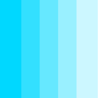

# chludek.com
This is the repository of my [personal web site chludek.com](https://chludek.com).

It's a super basic landing page at the moment. I created it back in 2016 and use it as a playground to try new things since then (and to get [100 points on google pagespeed/lighthouse](https://developers.google.com/speed/pagespeed/insights/?url=chludek.com) 😏).

## Technology
It's all pure HTML5 and CSS3 (and starting to add some JavaScript 😬). No fancy node.js magic, no container action, no overloaded framework, no toolchain with SASS, Polymer etc. Just nice and easy markup language that you can develop locally without installing thousands of packages (I have enough of this stuff at work 😆).

## Getting started
1. Clone it.
2. Open the `index.html` in your browser of choice.
3. ✨

## Stuff I use
* The awesome font is [Bebas Neue](https://github.com/dharmatype/Bebas-Neue) by [Ryoichi Tsunekawa](http://dharmatype.com).
* The font for the pixel heart is [Munro Regular](http://tenbytwenty.com#munro) by [Ed Merritt](http://edmerritt.com) and is modified (removed every character besides `v` and `3`).
* The button animation on the 404 page is based on [csshake](https://github.com/elrumordelaluz/csshake) and slightly modified.

## About me
My name is Alexander Chludek and I'm working in Bonn (Germany) as a web designer and front-end dev.
